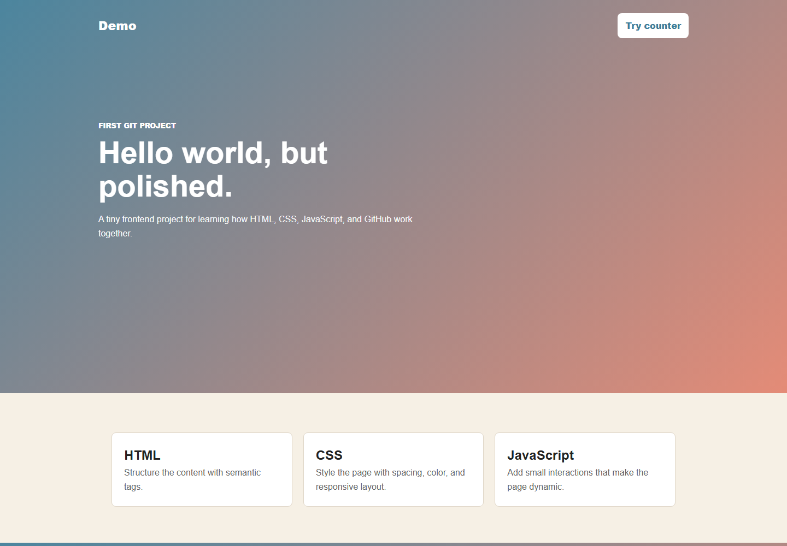

# Demo



This is a small beginner-friendly web project for practicing HTML, CSS, JavaScript, and Git commits.

Author: Rajesh Kasar

## Live Demo

https://rajesh-d-kasar.github.io/demo/

## Features

- Responsive landing page.
- Project cards for practice sections.
- JavaScript counter interaction.
- Clean file structure for learning.

## Run Locally

Open `index.html` in a browser.

## Deploy

This project is deployed with GitHub Pages from the `main` branch root.

## Files

```text
demo/
|-- README.md
|-- index.html
|-- style.css
|-- script.js
`-- assets/screenshot.png
```
